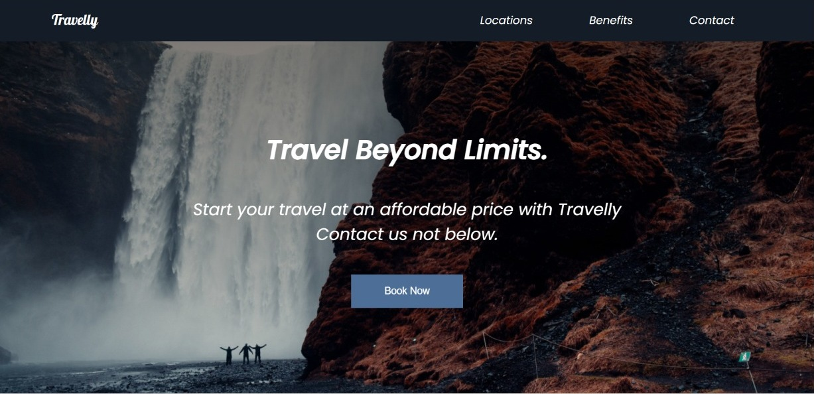
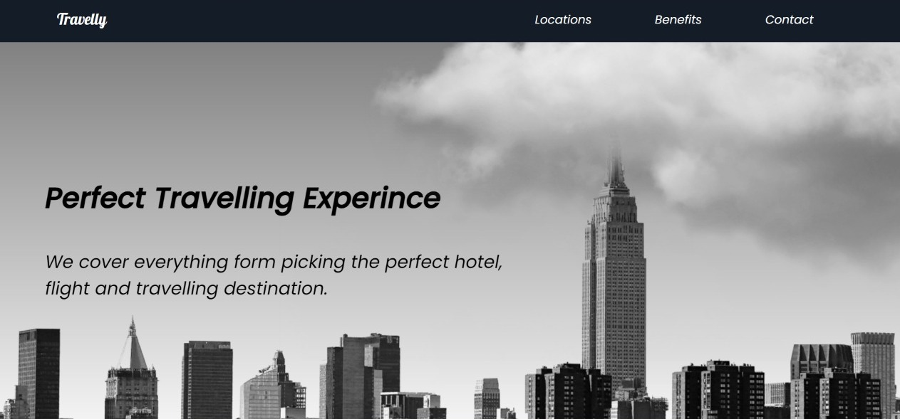
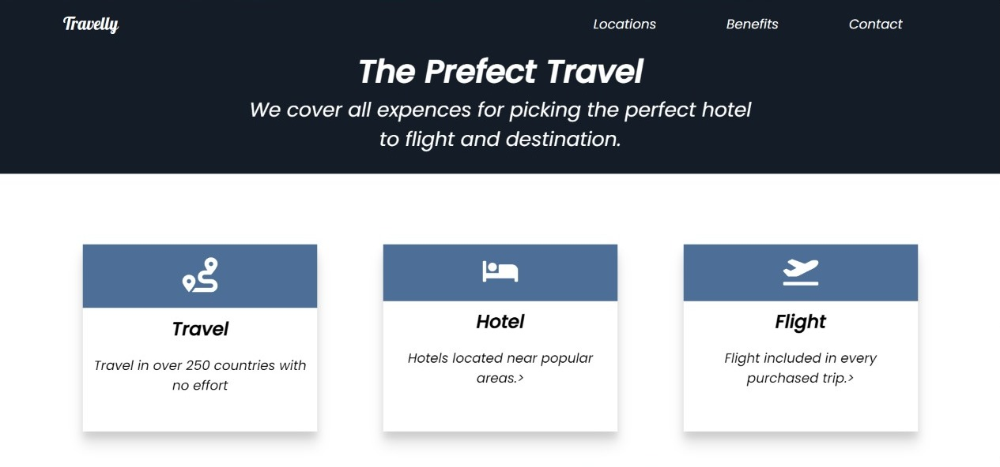
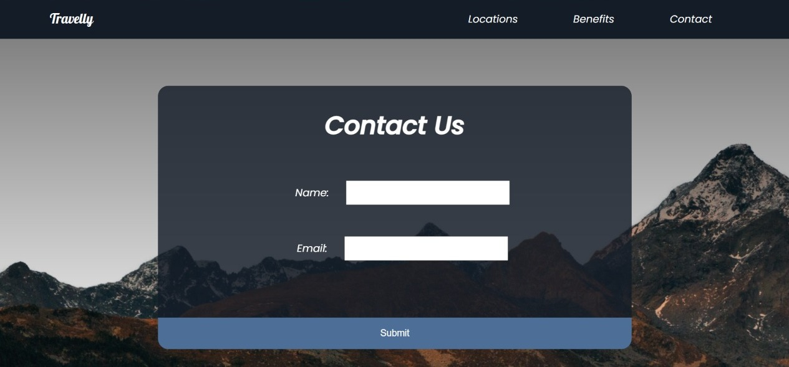

  
  
  
  

# 📖 [Tracelly agency] 

## 🚀 Live Demo 

> Add a link to your deployed project.

- [Live Demo Link](https://travel-agency-mocha.vercel.app/)

(<a href="#readme-top">back to top</a>)

## 👥 Author 

👤 **Nurgul**

- GitHub: [@githubhandle](https://github.com/NurkaAmre)
- Twitter: [@twitterhandle](https://twitter.com/AmreNurgul)
- LinkedIn: [LinkedIn](https://www.linkedin.com/in/amre-nurgul/)
